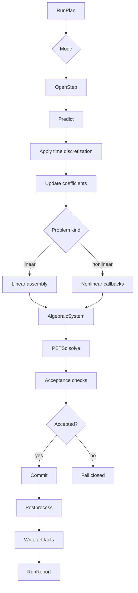
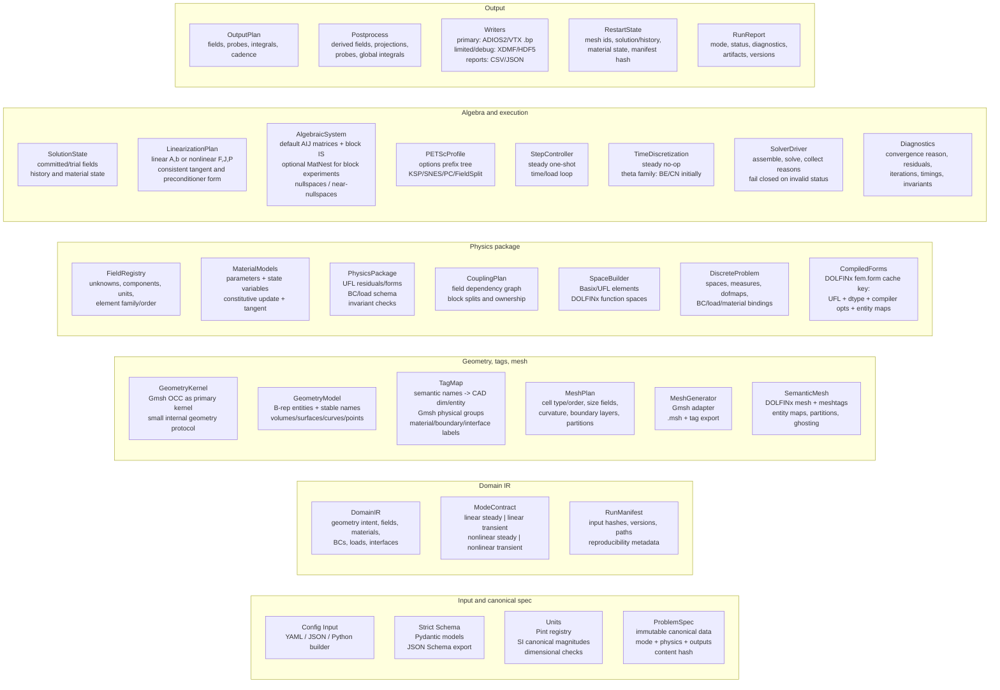
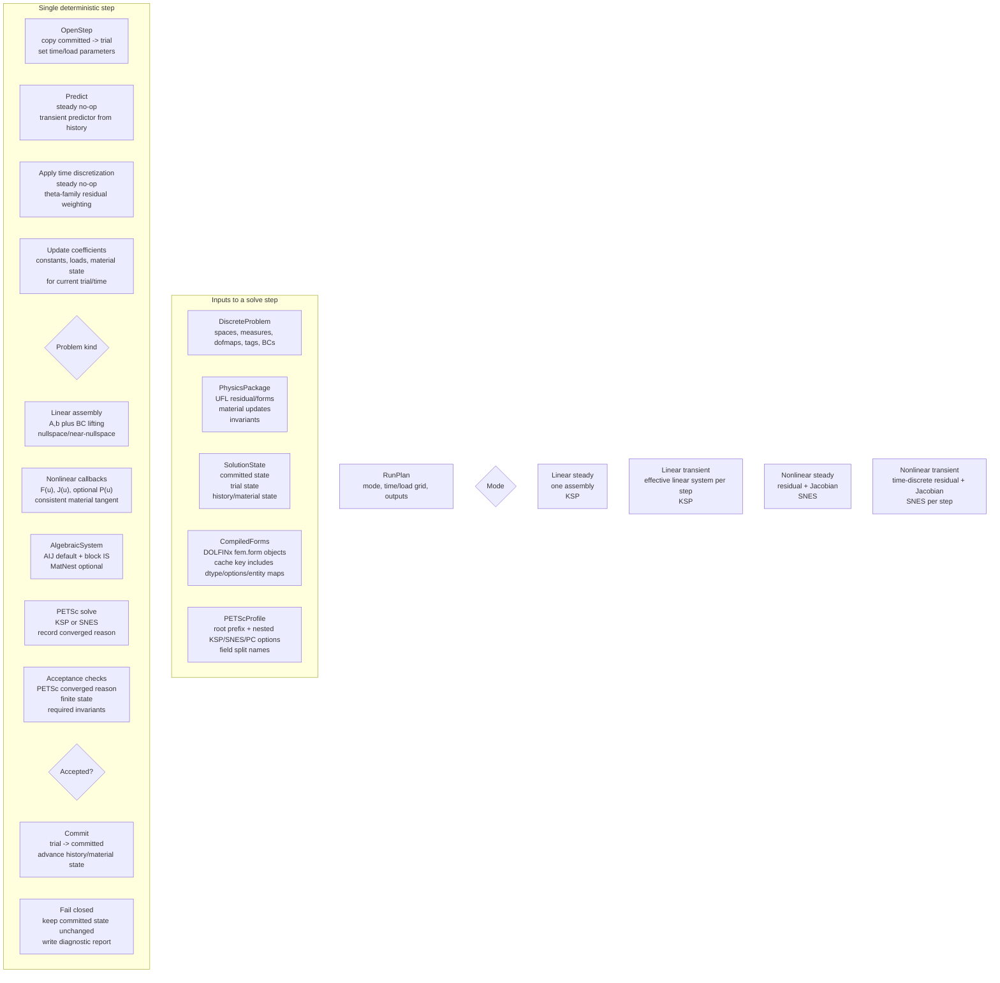

# Software Specification: Compact CAD + Multiphysics Simulation System

**Status:** Draft specification  
**Date:** 2026-07-05  
**Working name:** `cadmultiphysics`  
**Primary goal:** A compact, dependency-minimal CAD system with multiphysics simulation support.

---

## 1. Executive Summary

This system is a Python-first engineering application framework that converts validated problem specifications into reproducible CAD, mesh, finite-element, solver, and visualization artifacts. It is intentionally compact: the system should own only the orchestration layer, stable domain abstractions, validation rules, and extension contracts, while delegating specialized work to mature upstream libraries.

The core pipeline is:

```text
Config / Python builder
  -> strict schema + units
  -> immutable ProblemSpec
  -> geometry + semantic tags
  -> Gmsh mesh
  -> DOLFINx mesh + meshtags
  -> UFL physics forms
  -> PETSc linear/nonlinear solve
  -> ADIOS2/VTX results + reports + restart state
```

The system supports four first-class simulation modes:

1. Linear steady
2. Linear transient
3. Nonlinear steady
4. Nonlinear transient

A run is deterministic, fail-closed, and reproducible. Failed steps must not mutate committed state. Every run emits a manifest, diagnostics, version information, solver reasons, and references to output artifacts.

---

## 2. Design Principles

### 2.1 Compact core

The core package should remain small. It should define:

- canonical data structures;
- validation gates;
- geometry/mesh/physics/solver/output protocols;
- adapters to selected backends;
- deterministic execution rules;
- reports, manifests, and restart metadata.

The core should not reimplement CAD kernels, meshing algorithms, finite-element assembly, linear algebra, unit systems, or scientific visualization.

### 2.2 Dependency minimalism

Dependencies are grouped by role:

| Layer | Required dependency | Purpose |
|---|---|---|
| Schema | Pydantic | Strict models, validation, JSON Schema export |
| Units | Pint | Unit registry, dimensional checks, SI canonicalization |
| Geometry/mesh | Gmsh | OCC geometry, physical groups, meshing |
| FEM | DOLFINx, UFL | Mesh/function spaces/forms/assembly integration |
| Linear algebra | PETSc via petsc4py | KSP, SNES, PC, FieldSplit, convergence reasons |
| Output | ADIOS2 through DOLFINx VTXWriter | Primary simulation output |
| Visualization target | ParaView | User-facing inspection of VTX/BP outputs |

Optional adapters may support CadQuery import/export, XDMF/HDF5 debug output, and additional report formats, but optional adapters must not become required for the core runtime.

### 2.3 Semantic naming over raw IDs

Users should express intent with stable semantic names, for example `left_support`, `steel_body`, `cooling_interface`, and `heat_flux_top`. Raw CAD entity IDs and mesh tags are internal implementation details. The system is responsible for mapping semantic names to CAD entities, Gmsh physical groups, DOLFINx meshtags, measures, and boundary-condition bindings.

### 2.4 Immutable specs, mutable states

`ProblemSpec`, `DomainIR`, `RunManifest`, and mesh/field binding metadata are immutable once constructed. `SolutionState` is mutable only through explicit transaction-like step transitions:

```text
committed -> trial -> accepted -> committed
committed -> trial -> failed -> committed unchanged
```

### 2.5 Fail-closed execution

A solve step is accepted only when all acceptance checks pass:

- PETSc converged reason is acceptable;
- vector/state values are finite;
- physics invariants pass;
- required outputs are writable;
- restart metadata is consistent.

If any check fails, the committed state must remain unchanged and a diagnostic report must be written.

---

## 3. Relevant Upstream Sources and Design Implications

This specification uses the following external source facts as design constraints:

1. CadQuery is a Python library for intuitive parametric 3D CAD modeling. This supports a Python builder/import adapter, but not a hard dependency for the initial core.  
   Source: <https://cadquery.readthedocs.io/>

2. Gmsh is an automatic 3D finite-element mesh generator with geometry, mesh, solver, and post-processing modules, and its API supports parametric input and physical groups. This supports making Gmsh OCC the primary geometry/meshing backend.  
   Source: <https://gmsh.info/doc/texinfo/>

3. DOLFINx provides FEM infrastructure and PETSc-backed assembly helpers; its Gmsh interface can create DOLFINx mesh data and tags from Gmsh models. This supports the `SemanticMesh -> DiscreteProblem` transition.  
   Sources: <https://docs.fenicsproject.org/dolfinx/main/python/generated/dolfinx.fem.petsc.html>, <https://docs.fenicsproject.org/dolfinx/main/python/generated/dolfinx.io.gmsh.html>

4. UFL is a domain-specific language for declaring finite-element spaces and weak forms in notation close to mathematical notation. This supports expressing physics packages as UFL residuals, Jacobians, and derived forms.  
   Source: <https://docs.fenicsproject.org/ufl/main/>

5. PETSc KSP provides uniform access to linear solvers, SNES provides nonlinear solver infrastructure, and PCFIELDSPLIT supports field/block preconditioning. This supports solver profiles with nested prefixes and field-split names.  
   Sources: <https://petsc.org/release/manual/ksp/>, <https://petsc.org/release/manual/snes/>, <https://petsc.org/release/manualpages/PC/PCFIELDSPLIT/>

6. DOLFINx `VTXWriter` writes VTX files using ADIOS2, and these files can be viewed in ParaView. This supports ADIOS2/VTX `.bp` as the primary output path.  
   Source: <https://docs.fenicsproject.org/dolfinx/v0.10.0/python/generated/dolfinx.io.html>

7. ADIOS2 is a scalable scientific I/O framework and its BP engines write native binary-pack `.bp` outputs. This supports using ADIOS2/BP for high-volume field outputs and restart/checkpoint data.  
   Source: <https://adios2.readthedocs.io/en/latest/>

8. Pydantic supports validation with type annotations and JSON Schema generation. This supports using strict schema models as the public configuration contract.  
   Sources: <https://pydantic.dev/docs/validation/latest/get-started/>, <https://pydantic.dev/docs/validation/latest/concepts/json_schema/>

9. Pint provides a unit registry for physical quantities, unit conversion, and dimensional checks. This supports converting all user input to canonical SI magnitudes at the schema boundary.  
   Source: <https://pint.readthedocs.io/en/stable/api/base.html>

10. ParaView is an open-source, multi-platform application for scientific data analysis and visualization. This supports targeting ParaView-compatible outputs rather than implementing a native visualization frontend initially.  
    Source: <https://www.paraview.org/>

---

## 4. Scope

### 4.1 In scope

- CAD-oriented geometry construction through a compact internal geometry protocol.
- Gmsh OCC adapter as the primary geometry and meshing backend.
- Semantic tagging of bodies, boundaries, interfaces, curves, and points.
- Strict YAML/JSON/Python-builder input.
- Pydantic-backed schema validation and JSON Schema export.
- Pint-backed units and dimensional checking.
- DOLFINx mesh conversion, meshtags, function spaces, forms, and assembly integration.
- UFL-based physics packages.
- Linear steady and transient solves.
- Nonlinear steady and transient solves.
- PETSc KSP/SNES solver configuration through namespaced profiles.
- Field/block splits for multiphysics systems.
- Primary VTX/ADIOS2 `.bp` outputs.
- Limited/debug XDMF/HDF5 output.
- CSV/JSON reports.
- Restart state with manifest hash validation.
- Deterministic diagnostics and fail-closed state transitions.

### 4.2 Out of scope for the first implementation

- Full GUI CAD editor.
- Native visualization frontend.
- Reimplementation of OpenCASCADE, Gmsh, DOLFINx, PETSc, ADIOS2, or ParaView features.
- Automatic theorem-level verification of weak forms.
- Distributed workflow scheduling across clusters.
- Topology optimization, inverse design, or generative design as core features.
- Mesh adaptivity beyond initial hooks.
- Arbitrary symbolic unit algebra inside UFL expressions after canonicalization.

---

## 5. User Personas and Primary Workflows

### 5.1 Personas

**Engineering analyst**  
Defines geometry, materials, boundary conditions, and solver profiles; runs analyses; reviews outputs in ParaView.

**Physics package developer**  
Implements UFL residuals/forms, material updates, tangent operators, and invariant checks.

**Application developer**  
Builds domain-specific wrappers using the Python builder API and may hide low-level details from end users.

**CI/reproducibility owner**  
Runs benchmark problems, compares reports, validates schema evolution, and ensures deterministic behavior.

### 5.2 Main workflow

1. Author a problem in YAML, JSON, or Python builder API.
2. Validate schema and dimensional consistency.
3. Canonicalize units to SI magnitudes.
4. Build immutable `ProblemSpec` and content hash.
5. Create `DomainIR` and `RunManifest`.
6. Generate or import geometry.
7. Assign stable semantic tags.
8. Generate mesh and export tags.
9. Convert mesh/tags to DOLFINx semantic mesh.
10. Build function spaces and bind fields/materials/BCs/loads.
11. Compile UFL forms.
12. Assemble algebraic systems.
13. Solve with PETSc KSP or SNES.
14. Validate acceptance criteria.
15. Commit state or fail closed.
16. Postprocess and write outputs.
17. Emit reports and restart state.

---

## 6. System Architecture

### 6.1 High-level modules

```text
cadmultiphysics/
  schema/          # Pydantic models, JSON Schema export, migration helpers
  units/           # Pint registry, canonicalization, dimensional contracts
  ir/              # ProblemSpec, DomainIR, ModeContract, RunManifest
  geometry/        # internal geometry protocol, Gmsh OCC adapter, optional CadQuery adapter
  mesh/            # MeshPlan, Gmsh generation, DOLFINx semantic mesh conversion
  physics/         # FieldRegistry, MaterialModels, PhysicsPackage protocols
  discrete/        # spaces, measures, dofmaps, BC/load/material bindings, form cache
  solver/          # SolutionState, StepController, PETSc profiles, KSP/SNES drivers
  output/          # OutputPlan, postprocessing, VTX/XDMF/CSV/JSON writers, restart
  diagnostics/     # timings, convergence, invariants, quality checks
  cli/             # command-line entry points
  examples/        # validated examples
  tests/           # unit, integration, regression, benchmark tests
```

### 6.2 Core dataflow

```mermaid
flowchart LR
    CFG[Config Input] --> SCHEMA[Strict Schema]
    SCHEMA --> UNITS[Units]
    UNITS --> SPEC[ProblemSpec]
    SPEC --> DOMAIN[DomainIR]
    DOMAIN --> GEOM[GeometryModel]
    GEOM --> TAGS[TagMap]
    TAGS --> MESH[SemanticMesh]
    MESH --> DISCRETE[DiscreteProblem]
    DISCRETE --> FORMS[CompiledForms]
    FORMS --> ALG[AlgebraicSystem]
    ALG --> SOLVE[SolverDriver]
    SOLVE --> STATE[SolutionState]
    STATE --> POST[Postprocess]
    POST --> WRITE[Writers]
    WRITE --> REPORT[RunReport]
```



### 6.3 Solver-step dataflow



---

## 7. Public Interfaces

### 7.1 Command-line interface

The CLI should be stable, scriptable, and CI-friendly.

```bash
cadmp validate problem.yml
cadmp schema --format json > problem.schema.json
cadmp mesh problem.yml --out run/mesh
cadmp solve problem.yml --out run/result
cadmp restart run/result/restart.json --out run/restart_001
cadmp inspect run/result/report.json
cadmp version --full
```

Required CLI behavior:

- Nonzero exit code on validation failure, mesh failure, solve failure, output failure, or invariant failure.
- Machine-readable JSON diagnostics when `--json` is passed.
- No hidden global state.
- All output paths must be explicit or derived under a single run directory.
- Repeated runs with the same spec and environment should produce matching manifests, modulo timestamps and nondeterministic upstream numeric variation.

### 7.2 Python builder API

Example target API:

```python
from cadmultiphysics import Problem, units as u
from cadmultiphysics.physics import SolidMechanics, HeatTransfer

problem = (
    Problem("heated_bracket")
    .mode("nonlinear_transient")
    .geometry(lambda g: g.box("body", x=0.10*u.m, y=0.04*u.m, z=0.02*u.m))
    .material("steel", domain="body", model="linear_elastic_thermal", params={
        "E": 200e9*u.Pa,
        "nu": 0.3,
        "k": 45*u.W/(u.m*u.K),
    })
    .field("u", family="Lagrange", order=2, unit=u.m)
    .field("T", family="Lagrange", order=1, unit=u.K)
    .bc("fixed_left", on="left", field="u", value=[0, 0, 0]*u.m)
    .load("heat_top", on="top", field="T", flux=1e4*u.W/u.m**2)
    .time(start=0*u.s, stop=10*u.s, step=0.1*u.s, scheme="backward_euler")
    .output(fields=["u", "T"], every=1)
)

result = problem.run(out="runs/heated_bracket")
```

### 7.3 YAML input skeleton

```yaml
name: heated_bracket
mode: nonlinear_transient
units:
  system: SI
geometry:
  backend: gmsh_occ
  entities:
    - type: box
      name: body
      size: [0.10 m, 0.04 m, 0.02 m]
tags:
  materials:
    steel: {dim: 3, entities: [body]}
  boundaries:
    fixed_left: {dim: 2, selector: "x == 0"}
    heat_top: {dim: 2, selector: "z == 0.02 m"}
fields:
  - name: u
    kind: vector
    components: 3
    unit: m
    element: {family: Lagrange, order: 2}
  - name: T
    kind: scalar
    unit: K
    element: {family: Lagrange, order: 1}
materials:
  steel:
    model: thermoelastic_small_strain
    parameters:
      E: 200 GPa
      nu: 0.3
      k: 45 W/(m*K)
boundary_conditions:
  - name: fixed_left
    on: fixed_left
    field: u
    type: dirichlet
    value: [0 m, 0 m, 0 m]
loads:
  - name: heat_top
    on: heat_top
    field: T
    type: flux
    value: 10000 W/m^2
mesh:
  cell_type: tetrahedron
  order: 1
  size:
    global: 0.005 m
solver:
  nonlinear:
    snes_type: newtonls
    rtol: 1.0e-8
  linear:
    ksp_type: gmres
    pc_type: fieldsplit
output:
  format: vtx
  fields: [u, T]
  cadence: every_step
```

---

## 8. Canonical Data Model

### 8.1 `ProblemSpec`

`ProblemSpec` is the immutable canonical representation produced after schema validation and unit canonicalization.

Required fields:

| Field | Type | Description |
|---|---|---|
| `name` | string | Stable problem name |
| `version` | semantic version | Spec schema version |
| `mode` | `ModeContract` | One of the four supported modes |
| `geometry` | `GeometrySpec` | Geometry construction/import instructions |
| `tags` | `TagSpec` | Semantic material/boundary/interface names |
| `fields` | list[`FieldSpec`] | Unknowns and derived fields |
| `materials` | dict | Material models and parameters |
| `bcs` | list[`BoundaryConditionSpec`] | Essential/natural/mixed BC data |
| `loads` | list[`LoadSpec`] | Body, surface, point, and time-dependent loads |
| `mesh` | `MeshPlan` | Cell type/order, size fields, partitions |
| `solver` | `PETScProfile` | Solver option prefix tree |
| `output` | `OutputPlan` | Field/probe/report/restart cadence |
| `metadata` | dict | User metadata, source references |
| `content_hash` | string | Hash of canonical serialized content |

### 8.2 `DomainIR`

`DomainIR` is a backend-neutral representation of the problem domain.

It contains:

- geometry intent;
- semantic entity names;
- fields and field units;
- material domains;
- boundary and interface labels;
- load definitions;
- coupling dependency graph;
- validation metadata.

### 8.3 `ModeContract`

`ModeContract` defines what a physics package and solver path must provide.

| Mode | Required physics interface | Required solver path |
|---|---|---|
| `linear_steady` | Bilinear form `a(u, v)`, linear form `L(v)` | One KSP solve |
| `linear_transient` | Linear effective system per step | KSP per step |
| `nonlinear_steady` | Residual `F(u; v)`, Jacobian `J(du, v)` | SNES solve |
| `nonlinear_transient` | Time-discrete residual and Jacobian | SNES per step |

### 8.4 `RunManifest`

The manifest enables reproducibility and restart validation.

Required contents:

- schema version;
- content hash of canonical `ProblemSpec`;
- hashes of generated intermediate files;
- Python/package/backend versions;
- PETSc scalar type and precision;
- MPI size and partition metadata;
- mesh generation options;
- form compiler options;
- output paths;
- restart compatibility metadata.

---

## 9. Validation Gates

Validation gates occur at module boundaries. A gate returns either a typed validated object or a structured diagnostic error.

| Gate | Input | Output | Failure examples |
|---|---|---|---|
| Schema | raw config | `ProblemSpec` candidate | missing field, wrong enum, extra field in strict mode |
| Units | schema values | SI magnitudes | incompatible dimensions, unknown unit |
| Tags | geometry + tag spec | `TagMap` | empty selector, duplicate semantic name, wrong dimension |
| Mesh quality | generated mesh | `SemanticMesh` | missing physical group, invalid cells, insufficient quality |
| Discrete problem | mesh + physics | `DiscreteProblem` | BC field mismatch, missing material binding |
| Forms | UFL forms | `CompiledForms` | invalid form rank, unsupported element, entity-map mismatch |
| Solver profile | profile dict | `PETScProfile` | unknown split name, prefix collision |
| Output | output plan + state | writer handles | unsupported field family, unwritable path |
| Acceptance | solve result + state | committed state | divergent solve, NaN/Inf, invariant failure |

Errors must include:

```json
{
  "code": "TAG_EMPTY_SELECTION",
  "message": "Boundary tag 'fixed_left' selected no entities.",
  "path": ["tags", "boundaries", "fixed_left"],
  "severity": "error",
  "hint": "Check the selector expression or geometry dimensions."
}
```

---

## 10. Geometry and Tagging

### 10.1 Geometry kernel strategy

The primary kernel is Gmsh OCC.

The internal geometry layer exposes a small protocol:

```python
class GeometryKernel(Protocol):
    def box(self, name: str, size: Vec3, origin: Vec3 = ...) -> EntityRef: ...
    def cylinder(self, name: str, radius: float, height: float, axis: Vec3) -> EntityRef: ...
    def boolean_union(self, name: str, entities: list[EntityRef]) -> EntityRef: ...
    def boolean_cut(self, name: str, base: EntityRef, tools: list[EntityRef]) -> EntityRef: ...
    def fillet(self, name: str, edges: Selector, radius: float) -> EntityRef: ...
    def synchronize(self) -> None: ...
```

The protocol is intentionally smaller than Gmsh or OpenCASCADE. Advanced operations are available through backend-specific escape hatches, but escape hatches must be marked nonportable in the manifest.

### 10.2 Optional CadQuery adapter

CadQuery may be supported as:

- a geometry import adapter;
- a Python-builder convenience layer;
- an exchange path through STEP/BREP or direct shape translation when available.

CadQuery should not be required by the core package unless project priorities change.

### 10.3 Stable semantic tags

A `TagMap` maps semantic names to CAD dimension/entity pairs and later to physical groups and DOLFINx meshtags.

Tag dimensions:

| Dimension | Meaning |
|---:|---|
| 3 | volume/cell domain |
| 2 | surface/facet boundary or interface |
| 1 | curve/edge |
| 0 | point/vertex |

Rules:

- Every material region must map to at least one volume entity.
- Every boundary condition must map to at least one entity of valid dimension.
- Interfaces must preserve ownership and adjacent material information.
- Tag names must be unique within their namespace.
- Physical group IDs may be generated, but semantic names must be preserved.

---

## 11. Mesh Generation and Semantic Mesh

### 11.1 `MeshPlan`

Required fields:

- cell type: tetrahedron, hexahedron, triangle, quadrilateral, interval;
- geometric dimension;
- polynomial order;
- global size;
- optional local size fields;
- curvature refinement flags;
- optional boundary-layer settings;
- partitioning strategy;
- mesh-quality thresholds.

### 11.2 Gmsh generation

`MeshGenerator` responsibilities:

1. Initialize/finalize Gmsh safely.
2. Build or import geometry.
3. Synchronize OCC model.
4. Create physical groups from `TagMap`.
5. Apply size fields and mesh options.
6. Generate mesh.
7. Export `.msh` when requested.
8. Return mesh metadata and tag metadata.

### 11.3 DOLFINx conversion

`SemanticMesh` contains:

- DOLFINx mesh;
- cell tags;
- facet tags;
- optional edge/vertex tags;
- physical group name/id mapping;
- entity maps;
- partition and ghosting metadata;
- mesh quality report.

`SemanticMesh` is the only mesh object consumed by `DiscreteProblem`.

---

## 12. Physics Package Contract

A physics package is a plugin implementing a strict protocol.

```python
class PhysicsPackage(Protocol):
    name: str
    version: str

    def declare_fields(self) -> list[FieldSpec]: ...
    def declare_material_schema(self) -> type[BaseModel]: ...
    def declare_bc_schema(self) -> type[BaseModel]: ...
    def declare_load_schema(self) -> type[BaseModel]: ...
    def build_forms(self, ctx: FormContext) -> FormBundle: ...
    def update_coefficients(self, ctx: StepContext) -> None: ...
    def update_material_state(self, ctx: StepContext) -> None: ...
    def invariants(self, ctx: StepContext) -> list[InvariantResult]: ...
```

### 12.1 `FormBundle`

```python
@dataclass(frozen=True)
class FormBundle:
    kind: Literal["linear", "nonlinear"]
    residual: UFLForm | None
    jacobian: UFLForm | None
    preconditioner: UFLForm | None
    bilinear: UFLForm | None
    linear: UFLForm | None
    derived_forms: dict[str, UFLForm]
```

### 12.2 Material models

Material models may be stateless or stateful.

Required capabilities:

- parameter validation;
- unit/dimension declaration;
- state-variable declaration;
- constitutive update;
- consistent tangent when used in nonlinear solves;
- invariant checks.

Example invariant checks:

- positive density;
- positive heat capacity;
- admissible Poisson ratio;
- positive-definite elasticity tensor;
- temperature within model range;
- plastic internal variables remain finite and physically admissible.

### 12.3 Coupling plan

`CouplingPlan` describes dependencies among fields.

Example:

```text
T -> thermal_strain -> mechanical residual
u -> deformation_gradient -> conductivity update
```

The coupling plan is used to:

- order coefficient updates;
- define block splits;
- name PETSc field-split index sets;
- select monolithic vs staged coupling strategies.

Initial implementation should prioritize monolithic coupled solves for correctness and clear diagnostics. Partitioned/staggered solves can be added as an advanced execution strategy later.

---

## 13. Discrete Problem and Form Compilation

### 13.1 `DiscreteProblem`

Contains:

- DOLFINx mesh and meshtags;
- UFL measures;
- function spaces;
- trial/test functions;
- dofmaps;
- BC objects;
- load coefficients;
- material coefficient functions;
- field-to-block mapping;
- ownership/partition metadata.

### 13.2 `SpaceBuilder`

Responsibilities:

- construct Basix/UFL elements;
- construct DOLFINx function spaces;
- create mixed spaces where required;
- preserve field order;
- expose block index sets.

### 13.3 `CompiledForms`

Forms are cached by a content key that includes:

- UFL form identity/hash;
- mesh identity;
- scalar dtype;
- form compiler options;
- entity maps;
- coefficient layout;
- package versions.

The cache must be invalidated when any of these inputs changes.

---

## 14. Solver Architecture

### 14.1 `RunPlan`

`RunPlan` expands mode/time/load/output settings into deterministic steps.

Fields:

- mode;
- load increments;
- time grid;
- output cadence;
- restart cadence;
- checkpoint policy;
- stop policy.

### 14.2 `StepController`

Step lifecycle:

1. `OpenStep`: copy committed state to trial.
2. `Predict`: transient predictor or steady no-op.
3. `ApplyTimeDiscretization`: steady no-op or theta-family update.
4. `UpdateCoefficients`: loads, constants, material state for trial/time.
5. `Build`: assemble linear system or install nonlinear callbacks.
6. `Solve`: run PETSc KSP/SNES.
7. `Accept`: validate convergence, finiteness, invariants.
8. `Commit` or `FailClosed`.
9. `Postprocess` and `Write` if accepted.

### 14.3 Linear steady

- Assemble `A` and `b` once.
- Apply BC lifting and finalization.
- Attach nullspaces/near-nullspaces if required.
- Solve with KSP.
- Commit on successful acceptance.

### 14.4 Linear transient

- For each step, construct effective linear system.
- Initial schemes: backward Euler and Crank-Nicolson.
- Update time-dependent coefficients before assembly.
- Solve with KSP per step.
- Commit history after acceptance.

### 14.5 Nonlinear steady

- Define residual callback `F(u)`.
- Define Jacobian callback `J(u)`.
- Optional preconditioner form `P(u)`.
- Use SNES.
- Require consistent material tangent when material state is nonlinear.

### 14.6 Nonlinear transient

- Define time-discrete residual and Jacobian.
- Use SNES per time/load step.
- Trial state is advanced only after acceptance.
- Material state updates must be reversible or staged until commit.

### 14.7 Algebraic system

Default representation:

- PETSc AIJ matrices;
- PETSc vectors;
- block index sets for fields.

Optional experimental representation:

- PETSc MatNest for block-structured experiments.

Rules:

- AIJ is the default for robustness.
- MatNest requires explicit opt-in.
- Field split names must match `CouplingPlan` fields.
- Nullspace attachment is required for singular/near-singular systems.

### 14.8 PETSc profile

A `PETScProfile` is a typed options tree.

Example:

```yaml
solver:
  prefix: bracket_
  nonlinear:
    snes_type: newtonls
    snes_rtol: 1.0e-8
    snes_max_it: 25
  linear:
    ksp_type: gmres
    ksp_rtol: 1.0e-10
    pc_type: fieldsplit
    pc_fieldsplit_type: schur
  fieldsplits:
    u:
      ksp_type: preonly
      pc_type: hypre
    T:
      ksp_type: preonly
      pc_type: gamg
```

Validation rules:

- Prefixes must not collide.
- Fieldsplit names must refer to declared fields or field groups.
- Options must be namespaced under the run prefix.
- Unknown options may be passed through only when `allow_backend_options: true` is enabled.

---

## 15. State, Restart, and Transaction Semantics

### 15.1 `SolutionState`

Contains:

- committed fields;
- trial fields;
- previous-step history;
- material state;
- load/time parameters;
- step index;
- restart markers.

### 15.2 Commit rules

A commit is atomic at the framework level:

```text
trial fields -> committed fields
trial history -> committed history
trial material state -> committed material state
step index increments
```

No partial commit is allowed.

### 15.3 Restart state

Restart artifacts must include:

- manifest hash;
- mesh identity/hash;
- field values;
- history values;
- material state;
- time/load index;
- physics package versions;
- restart schema version.

Restart load must fail if:

- manifest hash mismatches, unless user explicitly allows compatible restart;
- mesh identity mismatches;
- field layout mismatches;
- physics package version is incompatible;
- state variables are missing.

---

## 16. Output and Postprocessing

### 16.1 `OutputPlan`

Fields:

- output directory;
- field names;
- derived fields;
- probes;
- integrals;
- cadence;
- restart cadence;
- report formats;
- writer options.

### 16.2 Primary field output

Primary field output is VTX/ADIOS2 `.bp` through DOLFINx writer facilities.

File layout target:

```text
run_dir/
  manifest.json
  report.json
  diagnostics.csv
  mesh/
    model.msh
    mesh_metadata.json
  fields/
    solution.bp/
  restarts/
    restart_0000.bp/
    restart_0000.json
  logs/
    run.log
```

### 16.3 Debug output

XDMF/HDF5 may be supported for debugging and compatibility, but should be documented as limited/debug output, not the primary path.

### 16.4 Reports

`RunReport` must include:

- status;
- mode;
- number of accepted/failed steps;
- convergence reasons;
- nonlinear/linear iteration counts;
- residual norms when available;
- timings;
- invariants;
- output artifact paths;
- warnings;
- environment versions.

---

## 17. Error Handling and Diagnostics

### 17.1 Error classes

```text
CadMPError
  SchemaError
  UnitError
  GeometryError
  TagError
  MeshError
  DiscretizationError
  FormCompilationError
  SolverConfigurationError
  SolveFailure
  InvariantFailure
  OutputError
  RestartError
```

### 17.2 Diagnostic record

Every diagnostic record has:

- code;
- severity;
- message;
- path or object reference;
- step index if applicable;
- source module;
- backend error if applicable;
- hint;
- structured payload.

### 17.3 Solver diagnostics

Solver diagnostics must capture:

- KSP/SNES converged reason;
- iteration count;
- final norm when available;
- nested KSP statistics for SNES;
- fieldsplit/subsolver statistics when available;
- assembly time;
- solve time;
- postprocessing time.

---

## 18. Security and Robustness

### 18.1 Config safety

YAML/JSON configs are data, not code. No arbitrary Python execution is allowed when loading YAML/JSON.

### 18.2 Python builder trust model

The Python builder is executable code and should be treated as trusted user code. CLI commands that run Python builder files must make this explicit.

### 18.3 Path safety

- Output paths must not escape the requested run directory unless explicitly allowed.
- Existing files are not overwritten unless `--overwrite` is passed.
- Atomic writes are preferred for JSON reports and manifests.

### 18.4 Backend failure containment

Backend exceptions are wrapped into structured diagnostics. Gmsh initialization/finalization must be guarded to avoid leaving global backend state corrupted.

---

## 19. Testing Strategy

### 19.1 Unit tests

- Schema validation.
- Unit conversion and dimensional checks.
- Tag selector behavior.
- Mode-contract validation.
- PETSc profile prefix generation.
- Diagnostic formatting.
- Manifest hashing.

### 19.2 Integration tests

- Geometry to Gmsh mesh.
- Gmsh mesh to DOLFINx mesh/tags.
- Scalar Poisson solve.
- Linear elasticity solve.
- Heat transient solve.
- Coupled thermoelastic solve.
- Nonlinear manufactured solution.
- Output writing and ParaView-openable VTX smoke test.
- Restart round trip.

### 19.3 Regression tests

Each example has a golden `report.json` tolerance specification:

```yaml
tolerances:
  l2_error: 1.0e-8
  max_iterations: 20
  total_energy_relative: 1.0e-6
```

### 19.4 Property-style tests

- Unit conversions preserve dimensions.
- Reordering YAML keys does not change content hash.
- Failed solve does not mutate committed state.
- Empty tag selectors always fail validation.
- Unknown fields in strict schemas fail validation.

---

## 20. Performance Requirements

### 20.1 Startup and validation

- Config validation for small problems should complete in under one second on a typical workstation.
- Schema export should not require geometry or solver backend initialization.

### 20.2 Assembly and solve

The framework adds orchestration overhead only. Heavy operations are delegated to DOLFINx/PETSc/Gmsh/ADIOS2. The framework should avoid unnecessary copies of large vectors, matrices, and mesh data.

### 20.3 Parallel execution

- MPI communicator is explicit in backend-facing APIs.
- Mesh partition metadata is recorded.
- Reports include MPI size.
- Serial execution remains supported for small examples.

---

## 21. Compatibility and Versioning

### 21.1 Spec schema versioning

Use semantic versioning for config schema:

```text
major.minor.patch
```

- Major: breaking schema changes.
- Minor: backward-compatible additions.
- Patch: clarifications or bug fixes.

### 21.2 Migration

Provide migration helpers:

```bash
cadmp migrate old.yml --from 0.1 --to 0.2 > new.yml
```

Migrations must preserve semantic meaning or emit warnings when manual intervention is required.

### 21.3 Backend versions

The manifest records backend versions. The project should define a tested compatibility matrix in release notes.

---

## 22. Initial Physics Packages

### 22.1 Poisson / scalar diffusion

Purpose: simplest end-to-end validation of mesh, tags, spaces, forms, KSP, output.

Modes:

- linear steady;
- linear transient.

### 22.2 Heat transfer

Features:

- conduction;
- volumetric source;
- Neumann flux;
- Dirichlet temperature;
- backward Euler and Crank-Nicolson.

### 22.3 Small-strain linear elasticity

Features:

- displacement field;
- body force;
- traction;
- Dirichlet constraints;
- near-nullspace support for unconstrained/weakly constrained cases.

### 22.4 Thermoelastic coupling

Features:

- displacement + temperature;
- thermal strain;
- monolithic block system;
- field split preconditioning.

### 22.5 Nonlinear hyperelasticity prototype

Features:

- residual/Jacobian workflow;
- SNES diagnostics;
- material invariant checks;
- fail-closed nonlinear state handling.

---

## 23. Acceptance Criteria for MVP

The MVP is complete when all of the following are true:

1. A YAML problem can be validated and converted to immutable `ProblemSpec`.
2. JSON Schema can be exported for the input format.
3. Units are canonicalized to SI and incompatible dimensions fail validation.
4. A simple Gmsh OCC geometry can be generated from the Python builder.
5. Semantic material and boundary tags survive Gmsh meshing and DOLFINx conversion.
6. A scalar Poisson problem solves with PETSc KSP.
7. A nonlinear manufactured problem solves with PETSc SNES.
8. A transient heat problem advances at least ten steps with restart output.
9. Failed solver convergence leaves committed state unchanged.
10. VTX/ADIOS2 output is written and can be opened in ParaView.
11. `report.json` includes status, solver reasons, timings, versions, and artifact paths.
12. CI runs unit and integration tests in serial mode.

---

## 24. Roadmap

### Phase 0: Skeleton

- Package layout.
- Pydantic schema stubs.
- Pint unit registry.
- CLI skeleton.
- Manifest hashing.

### Phase 1: Geometry and mesh

- Gmsh OCC adapter.
- Semantic tag mapping.
- MeshPlan.
- DOLFINx mesh conversion.
- Mesh quality diagnostics.

### Phase 2: Linear FEM

- FieldRegistry.
- SpaceBuilder.
- DiscreteProblem.
- UFL form bundle.
- Poisson and linear elasticity examples.
- PETSc KSP profile.

### Phase 3: Transient execution

- RunPlan.
- StepController.
- theta-family time discretization.
- history state.
- restart metadata.

### Phase 4: Nonlinear execution

- SNES callbacks.
- material state staging.
- consistent tangent contract.
- nonlinear diagnostics.

### Phase 5: Coupled multiphysics

- CouplingPlan.
- mixed/multi-field spaces.
- field split names and index sets.
- thermoelastic example.

### Phase 6: Output hardening

- VTX/ADIOS2 field output.
- restart BP output.
- CSV/JSON reports.
- ParaView smoke tests.

### Phase 7: Optional adapters

- CadQuery adapter.
- STEP/BREP import.
- additional physics packages.
- richer postprocessing.

---

## 25. Open Questions

1. Should the initial geometry builder expose only primitives and booleans, or also selectors such as “largest face normal to +x”?
2. Should CadQuery be an optional adapter from day one or delayed until after Gmsh-only MVP?
3. Should mixed spaces be the default for coupled physics, or should separate spaces with block maps be preferred initially?
4. Should restart state use DOLFINx-native VTX/ADIOS2 only, or a specialized ADIOS2 layout for history/material variables?
5. How strict should backend option validation be for PETSc? A strict typed subset improves UX, while pass-through options preserve advanced flexibility.
6. Which mesh-quality thresholds should be default-blocking versus warning-only?
7. What minimum MPI behavior is required for MVP CI?

---

## 26. Glossary

| Term | Meaning |
|---|---|
| `ProblemSpec` | Immutable canonical problem input after schema and unit validation |
| `DomainIR` | Backend-neutral representation of geometry, fields, materials, BCs, loads, and interfaces |
| `TagMap` | Mapping from semantic names to CAD entities, physical groups, and mesh tags |
| `SemanticMesh` | DOLFINx mesh plus meshtags and semantic metadata |
| `PhysicsPackage` | Plugin that declares fields/schemas and builds UFL forms/material updates/invariants |
| `DiscreteProblem` | Mesh, spaces, measures, dofmaps, BCs, loads, material bindings |
| `CompiledForms` | DOLFINx-compiled forms and cache metadata |
| `SolutionState` | Committed/trial fields plus history and material state |
| `PETScProfile` | Typed PETSc options and prefix tree |
| `RunReport` | Machine-readable result summary and diagnostics |
| `VTX/BP` | DOLFINx/ADIOS2 output format intended for visualization in ParaView |

---

## 27. Appendix: Uploaded Architecture Source Diagrams

### 27.1 Core architecture diagram



### 27.2 Solver architecture diagram


